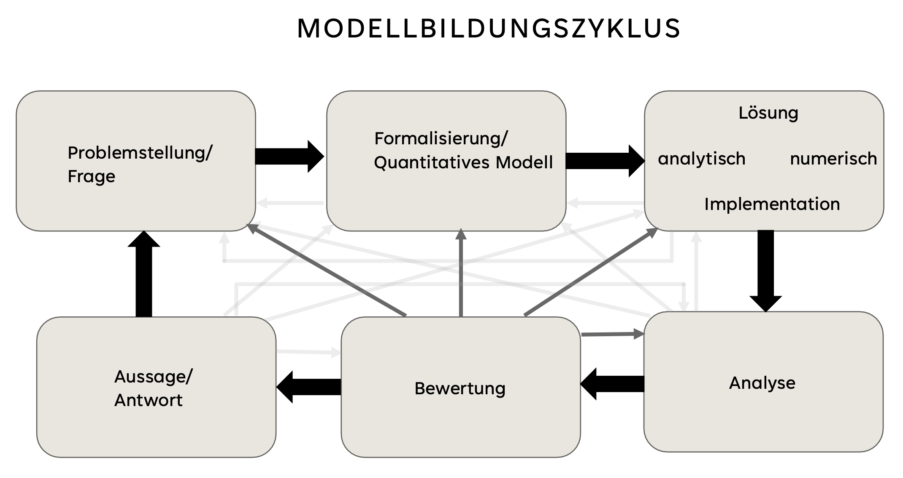

### Modellierungszyklus

# Durchlauf der Modellierungszyklen

#TODO dokumentieren

- Sättigung wird nie gesenkt -> model anpassen

- erster Plot: sehr kurzer spike, dann praktisch 0 -> hungerfaktor runterdrehen